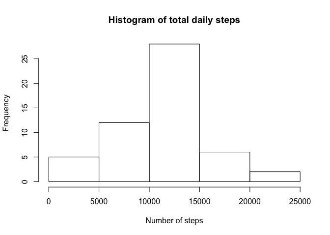
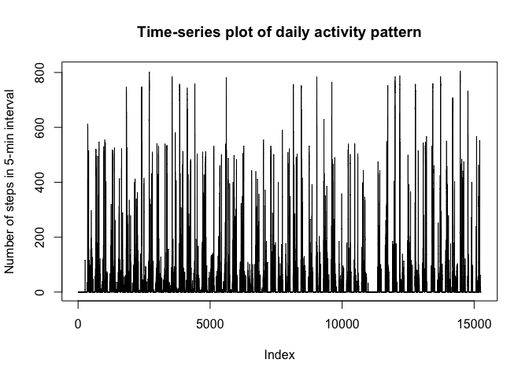
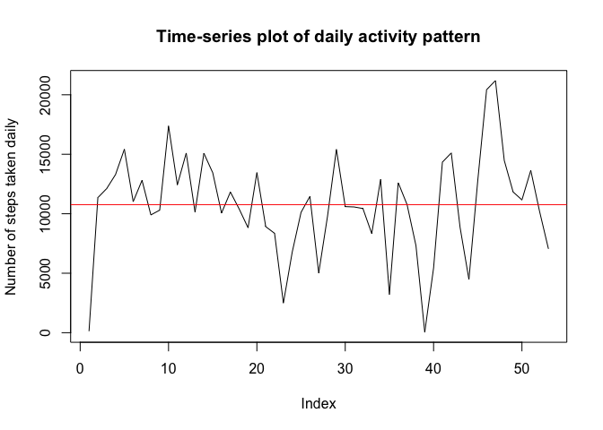
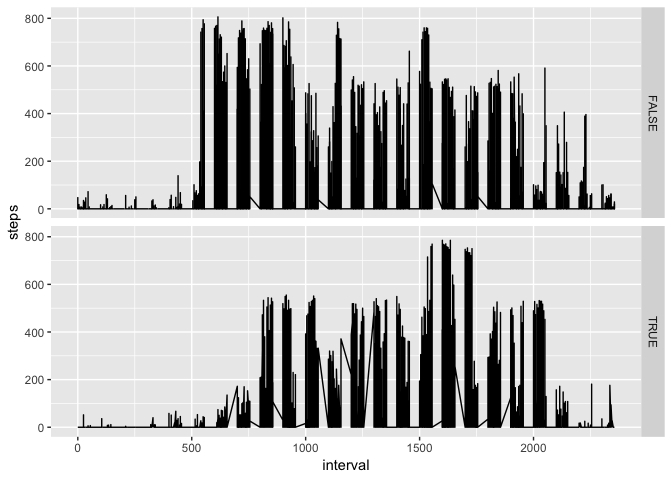
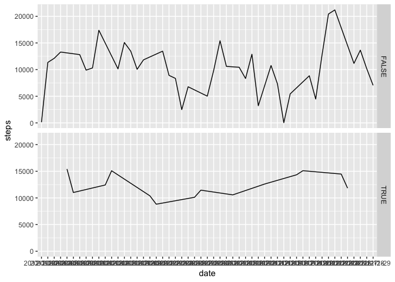

### Loading and preprocessing the data
Before running the code below, ensure that the working directory is set to the folder containing the activity data file. The data will be pre-processed by removing *NA* values from the dataset to simplify subsequent calculations. The code will first read the dataset and store it in the variable __*data.raw*__ (that will include all datapoints - in case this is required later in the analysis). The rows with *NA* values will be removed and that final dataset will be stored in variable __*data*__ for further analysis.


```r
data.raw <- read.csv("./activity.csv")
rem.rows <- apply(data.raw, 1, function(x){any(is.na(x))})
data <- data.raw[!rem.rows, ]
```


### What is mean total number of steps taken per day?
The total number of steps taken will be determined and thereafter divided by the number of days in the measurement period. The __*data*__ set will be used for this calculation, which, when a count of the number of days is done yields 53 days (compared to 61 days if the __*data.raw*__ set is used). The removal of *NA* values therefore yields a higher average number of daily steps than one would be inclined to believe based on the raw data.


```r
days <- length(unique(data$date))
totSteps <- sum(data$steps)
meanSteps <- totSteps / days
```

We would also want to plot a histogram to get a graphical presentation of the total number of steps taken daily. The dplyr package will be installed to enable us to summarise the data based on total daily activity. The dataset with the daily activity will be named __*summ*__ and will show the total number of steps taken on a specific day. This new dataset will enable us to also determine the median number of steps taken daily.


```r
summ <- group_by(data, date)
summ <- summarise(summ, steps = sum(steps))
```

The mean and median number of steps taken per day is shown below, by the value of __*meanSteps*__ (already calculated above) and __*medianSteps*__ respectively.


```r
medianSteps <- median(summ$steps)

meanSteps
```

```
## [1] 10766.19
```

```r
medianSteps
```

```
## [1] 10765
```


```r
hist(summ$steps, main = "Histogram of total daily steps", xlab = "Number of steps")
```

<!-- -->

### What is the average daily activity pattern?
A time-series plot will be made from the 5-minute interval data to show what the average daily activity is.


```r
plot(data$steps, type = "l", main = "Time-series plot of daily activity pattern", ylab = "Number of steps in 5-min interval")
```

<!-- -->

A second time-series plot will be made using daily total steps data and include the mean (<span style="color:red">__red__</span> line) steps taken daily. Given that the mean and median steps (10766 and 10765 respectively) taken daily are so close, they are illegible when added to this plot. Hence, only the mean steps will be added.


```r
plot(summ$steps, type = "l", main = "Time-series plot of daily activity pattern", ylab = "Number of steps taken daily")
abline(h = meanSteps, col = "red")
```

<!-- -->

Another interesting datapoint that can help us understand the activity data better is the interval with the highest average number of steps. Once the data is summarized (as done previously using dates), it will be stored in variable __*intervalsumm*__.


```r
intervalsumm <- group_by(data, interval)
intervalsumm <- summarise(intervalsumm, aveSteps = mean(steps))
```

The first few rows of the sorted __*intervalsumm*__ data is shown below. From the results shown, we can see that intervals 835, 840 and 850 are the ones with the most average daily activity.


```r
head(intervalsumm[order(intervalsumm$aveSteps, decreasing = TRUE), ])
```

```
## # A tibble: 6 x 2
##   interval aveSteps
##      <int>    <dbl>
## 1      835     206.
## 2      840     196.
## 3      850     183.
## 4      845     180.
## 5      830     177.
## 6      820     171.
```

### Imputing missing values
An assessment is done of the effect that missing values could have had on the analysis done above. A few questions are answered below to illustrate how these values have been dealt with above.

1. *Calculate and report the total number of missing values in the dataset (i.e. the total number of rows with NAs).* - This is done by simply deducting the length of the __*data.raw*__ set from the length of the __*data*__ set - the result obtained showing that there are __2304__ *NA* values in the original dataset.

2. *Devise a strategy for filling in all of the missing values in the dataset. The strategy does not need to be sophisticated. For example, you could use the mean/median for that day, or the mean for that 5-minute interval, etc.* - These values were excluded from the analysis. This won't affect the results adversely given that the average results obtained above would remain unchanged. In fact, this is the better option given that filling in the *NA* values with the average of the other obtained values would make the histogram obtained above steeper than it should be in reality.

3. *Create a new dataset that is equal to the original dataset but with the missing data filled in.* - This has already been done and stored in the __*data*__ set that was used for all the analyses above.

4. *Make a histogram of the total number of steps taken each day and calculate and report the mean and median total number of steps taken per day. Do these values differ from the estimates from the first part of the assignment? What is the impact of imputing missing data on the estimates of the total daily number of steps?* - This has already been done in the original analysis.

### Are there differences in activity patterns between weekdays and weekends?
For this part, we will continue to utilize the __*data*__ set that was used for the other parts of the analysis.

The first step to determine this will be to add the weekday to both the __*data*__ and __*summ*__ sets so that we can establish if there are any differences in activity - at 5 min intervals and aggregated daily. For these plots, __ggplot2__ is installed from the library.


```r
data <- cbind(data, weekdays(as.Date(data$date)))
colnames(data) = c("steps", "date", "interval", "weekday")
datacol <- data$weekday == "Saturday" | data$weekday == "Sunday"
data <- cbind(data, datacol)
colnames(data) = c("steps", "date", "interval", "weekday", "weekend?")

dp <- ggplot(data, aes(x = interval, y = steps)) + geom_line() + facet_grid(data[, 5] ~ .)
```
The graphs plotted below are split by TRUE / FALSE as an answer to the question whether the weekday falls on a weekend, i.e. the "TRUE" panel is for weekends and the "FALSE" panel is for weekdays.


```r
dp
```

<!-- -->

```r
summ <- cbind(summ, weekdays(as.Date(summ$date)))
colnames(summ) = c("date", "steps", "weekday")
summcol <- summ$weekday == "Saturday" | summ$weekday == "Sunday"
summ <- cbind(summ, summcol)
colnames(summ) = c("date", "steps", "weekday", "weekend?")

sp <- ggplot(summ, aes(x = date, y = steps, group = 1)) + geom_line() + facet_grid(summ[, 4] ~ .)
```
The plots below are based on day-level data and are split in the same way as the 5-min interval data as shown above.


```r
sp
```

<!-- -->
